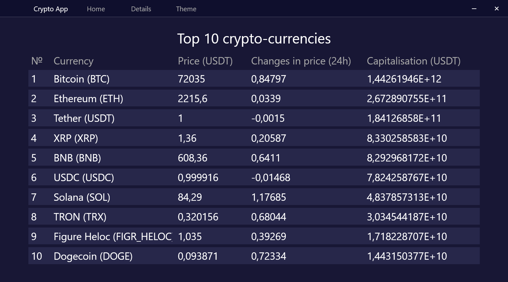
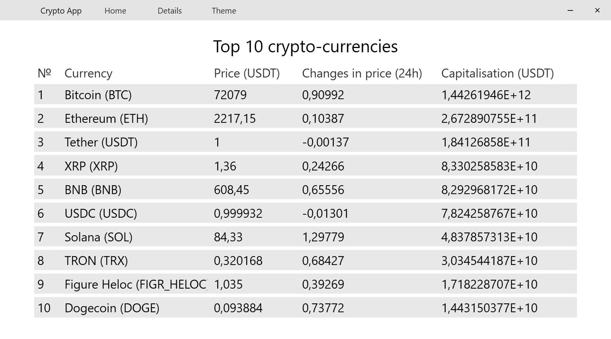
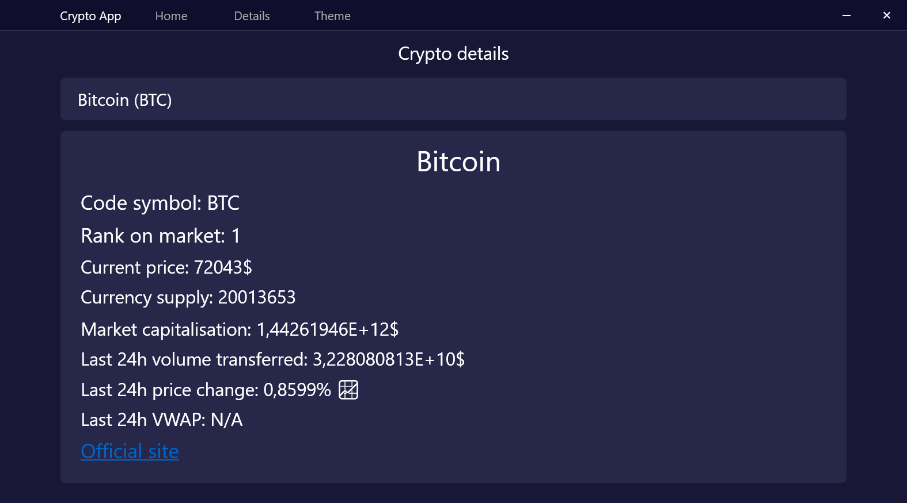

# Crypto App

A lightweight WPF desktop app for tracking cryptocurrency prices in real time. Built in 2025 with .NET 8 and the MVVM pattern.

## Screenshots

### Home — Top 10 by market cap

**Dark theme**


**Light theme**


### Details — Search any coin



## Features

- **Top 10 table** — live price, 24h change, and market cap for the top 10 coins by market cap
- **Coin search** — type any coin name to get an autocomplete dropdown, click to load full details
- **Details view** — shows rank, price, supply, market cap, 24h volume, and 24h price change with trend indicator
- **Light / dark theme** — toggle from the navigation bar
- **Custom window chrome** — frameless window with drag, minimize, and close controls

## Requirements

- Windows 10 or later
- [.NET 8 Runtime](https://dotnet.microsoft.com/download/dotnet/8.0)

## Build & run

```bash
git clone https://github.com/your-username/CryptoApp.git
cd CryptoApp
dotnet run --project CryptoApp/CryptoApp.csproj
```

Or build a Release binary:

```bash
dotnet build -c Release
```

The executable will be at `CryptoApp/bin/Release/net8.0-windows/CryptoApp.exe`.

## Data source

Prices and market data are fetched from the [CoinGecko public API](https://www.coingecko.com/en/api) — no API key required.

## Tech stack

| | |
|---|---|
| Framework | .NET 8 / WPF |
| Architecture | MVVM |
| HTTP | `System.Net.Http.HttpClient` |
| JSON | `System.Text.Json` |
| Data | CoinGecko REST API v3 |
